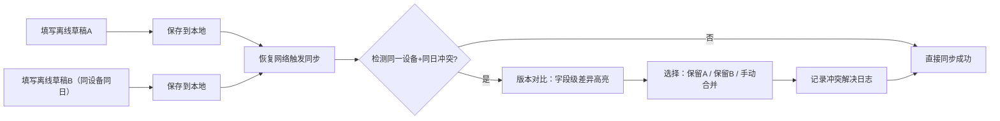

## 1. 产品概述

离线巡检移动 Web 工具，支持设备巡检在弱网/离线场景下的草稿填写、照片占位、异常上报，恢复网络后自动同步并处理同一设备同一天的冲突版本。

- 目标用户：设备巡检管理员和一线巡检员
- 核心价值：解决弱网环境下巡检填报不中断、数据不丢失、冲突可追溯

## 2. 核心功能

### 2.1 用户角色

| 角色 | 进入方式 | 核心权限 |
|------|----------|----------|
| 管理员 | 首页切换角色 | 配置巡检模板、设备表、异常等级、导出记录、查看操作日志 |
| 巡检员 | 首页切换角色 | 选择设备巡检、填写草稿、拍照占位、提交异常、离线同步、解决冲突 |

### 2.2 功能模块

1. **首页/角色切换**：角色选择、离线模式开关、网络状态、样例设备快捷入口
2. **管理员-模板配置**：巡检模板 CRUD、字段配置（类型/必填/异常等级）、模板版本管理
3. **管理员-设备管理**：设备列表（样例数据）、设备分类、设备详情
4. **巡检员-巡检列表**：今日待巡检设备、草稿状态、同步状态、异常状态
5. **巡检员-巡检填报**：动态表单、照片占位、必填校验、离线保存草稿
6. **同步与冲突**：待同步列表、冲突检测、版本对比、冲突选择/合并
7. **导出与日志**：巡检记录导出（CSV/JSON）、操作日志、冲突解决记录

### 2.3 页面详情

| 页面名称 | 模块名称 | 功能描述 |
|----------|----------|----------|
| 首页 | 角色切换 | 管理员/巡检员角色切换，离线模式开关，网络状态指示 |
| 首页 | 统计概览 | 待巡检数、草稿数、待同步数、异常数、冲突数 |
| 模板配置页 | 模板列表 | 模板卡片、版本号、启用状态、编辑/复制/删除 |
| 模板配置页 | 模板编辑 | 字段配置（文本/数字/选择/照片/备注）、必填标记、异常等级映射 |
| 设备管理页 | 设备列表 | 设备编号、名称、位置、分类、状态、样例数据初始化 |
| 巡检列表页 | 待办列表 | 今日巡检设备、过滤筛选、状态标签（草稿/已提交/待同步/异常/冲突） |
| 巡检填报页 | 动态表单 | 按模板渲染字段、实时必填校验、异常等级选择 |
| 巡检填报页 | 照片占位 | 调用相机或文件、保存为离线占位（文件名+时间戳+缩略）、真实上传延迟到同步 |
| 巡检填报页 | 草稿保存 | 自动保存草稿、手动保存、防止两个草稿互相覆盖 |
| 同步中心页 | 待同步队列 | 显示所有离线操作、进度、单条重试、批量同步 |
| 同步中心页 | 冲突解决 | 同一设备+同一天冲突，版本对比（字段级差异高亮），选择本地/远端/合并 |
| 导出记录页 | 记录列表 | 按日期/设备/状态筛选、单条详情、批量选择导出 |
| 操作日志页 | 日志列表 | 时间、用户、操作类型、对象、结果、冲突解决记录 |

## 3. 核心流程

### 3.1 管理员流程

管理员登录 → 进入模板配置 → 创建/编辑巡检模板 → 配置字段（必填项、异常等级）→ 启用模板 → 配置设备表 → 巡检员开始使用

### 3.2 巡检员离线流程

巡检员选择设备 → 离线模式下填写表单 → 照片占位保存 → 保存草稿（自动+手动）→ 浏览器刷新 → 恢复草稿 → 恢复网络 → 进入同步中心 → 检测冲突 → 选择版本 → 同步成功 → 可导出记录

### 3.3 冲突解决流程

## 4. 用户界面设计

### 4.1 设计风格

- **主色调**：深靛蓝 `#1e3a5f`（工业专业感）+ 安全橙 `#f97316`（异常/警示）
- **辅助色**：浅灰蓝背景 `#f1f5f9`，成功绿 `#10b981`，警戒黄 `#f59e0b`
- **按钮风格**：圆角 10px，按压有阴影反馈，禁用态半透明
- **字体**：系统无衬线字体 + 数字等宽
- **布局风格**：移动端优先卡片式，底部 Tab 导航，顶部标题栏
- **图标风格**：Lucide 线性图标，大小统一 18-20px

### 4.2 页面设计概览

| 页面名称 | 模块名称 | UI 元素 |
|----------|----------|---------|
| 首页 | 顶部栏 | 角色切换下拉、网络状态指示灯、离线开关 |
| 首页 | 统计卡 | 5 个彩色圆角卡片（待巡检/草稿/待同步/异常/冲突）带数字动画 |
| 首页 | 快捷操作 | 大按钮卡片：开始巡检、同步中心、模板配置、导出记录 |
| 巡检填报页 | 表单 | 分组卡片、必填红星、异常等级彩色徽章、错误提示条 |
| 巡检填报页 | 照片区 | 九宫格占位，点击调用相机，缩略图+文件名+删除 |
| 冲突解决页 | 对比视图 | 左右两栏对比，差异字段黄色高亮，底部操作栏选择版本 |

### 4.3 响应式

- 移动端优先（375px 起），使用 Tailwind 断点 `sm: md: lg:`
- 底部 Tab 导航仅在移动端显示，桌面端改为侧边栏
- 触摸目标 ≥ 44×44px，表单输入框高度 ≥ 48px
- 冲突对比在窄屏改为上下堆叠布局

### 4.4 离线与异常场景可视化

- 网络离线：顶部红色横幅 + 全局离线角标
- 离线模拟开关：首页顶部，切换时吐司提示
- 必填缺失：字段红色边框 + 下方错误文字 + 提交按钮禁用
- 草稿冲突：保存时弹出二次确认"已有同日草稿，覆盖/另存新版本"
- 冲突字段：黄色背景 + 左右箭头对比标记
