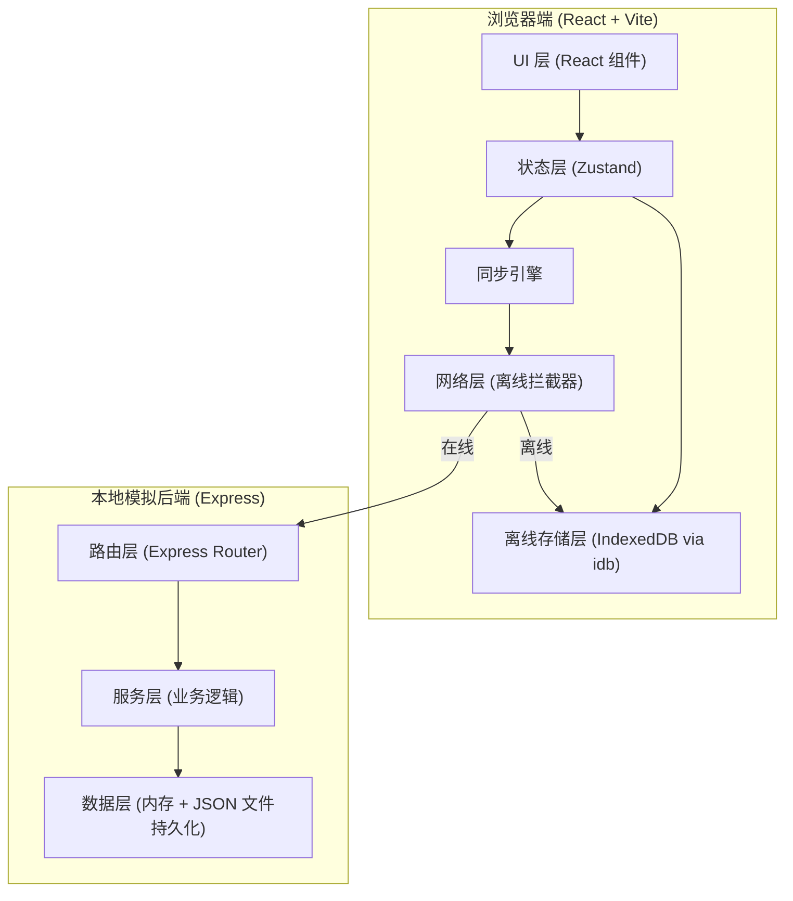
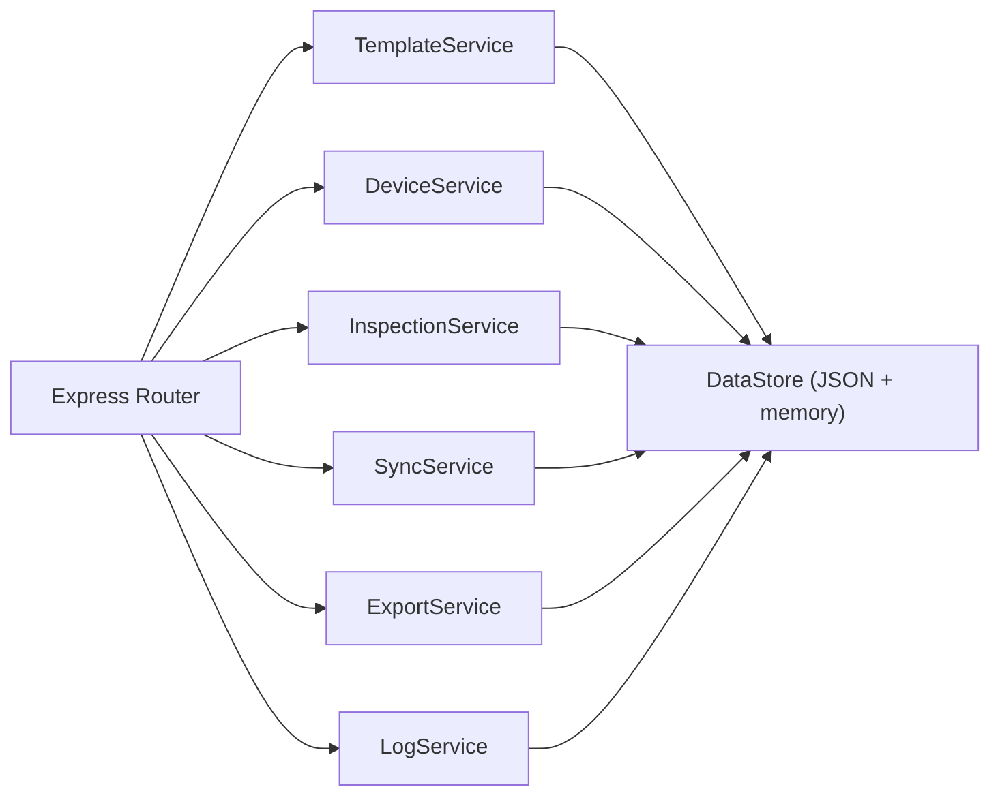
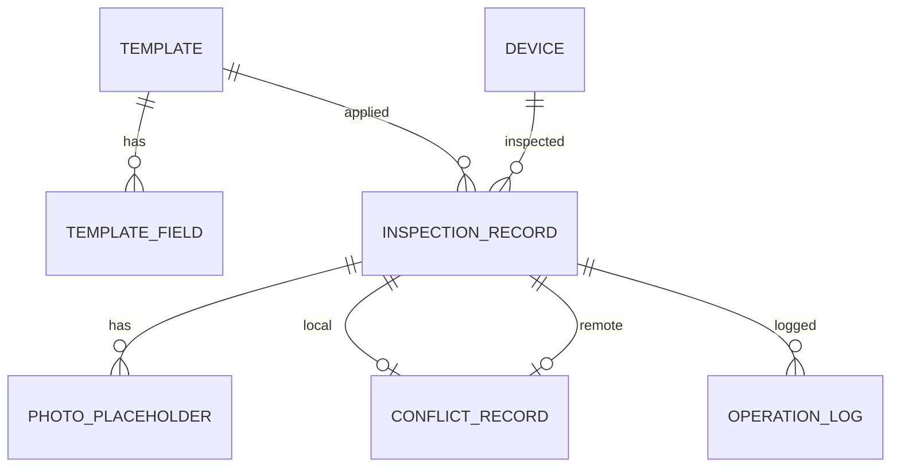

## 1. 架构设计



## 2. 技术说明

- **前端**：React@18 + TypeScript + Vite + TailwindCSS@3 + Zustand + React Router DOM + Lucide React + idb（IndexedDB 包装）
- **初始化工具**：vite-init（react-express-ts 模板）
- **后端**：Express@4 + TypeScript，使用内存数据 + JSON 文件持久化模拟后端
- **离线策略**：前端拦截 fetch，离线模式下走 IndexedDB，在线时走 Express API
- **离线模拟方式**：1) Service Worker 拦截（真实离线） 2) 前端开关模拟拦截请求（快速切换）

## 3. 路由定义

| 路由 | 用途 |
|------|------|
| / | 首页：角色切换、统计概览、快捷操作、离线开关 |
| /templates | 管理员：模板列表 |
| /templates/:id | 管理员：模板编辑 |
| /devices | 管理员：设备列表管理 |
| /inspections | 巡检员：今日巡检列表 |
| /inspections/:deviceId | 巡检员：巡检填报页 |
| /sync | 同步中心：待同步队列 + 冲突解决 |
| /export | 导出记录：巡检记录筛选与导出 |
| /logs | 操作日志：所有操作和冲突解决记录 |

## 4. API 定义

```typescript
// 模板
interface Template {
  id: string;
  name: string;
  version: number;
  enabled: boolean;
  fields: TemplateField[];
  createdAt: string;
  updatedAt: string;
}

interface TemplateField {
  id: string;
  key: string;
  label: string;
  type: 'text' | 'number' | 'select' | 'photo' | 'textarea';
  required: boolean;
  options?: string[];
  anomalyLevel?: 'low' | 'medium' | 'high' | 'critical'; // 此字段异常时触发的等级
}

// 设备
interface Device {
  id: string;
  code: string;
  name: string;
  location: string;
  category: string;
  status: 'normal' | 'maintenance' | 'offline';
}

// 巡检记录
interface InspectionRecord {
  id: string;
  deviceId: string;
  templateId: string;
  templateVersion: number;
  inspectorId: string;
  inspectorName: string;
  date: string; // YYYY-MM-DD
  values: Record<string, any>;
  photos: PhotoPlaceholder[];
  anomalyLevel: 'none' | 'low' | 'medium' | 'high' | 'critical';
  status: 'draft' | 'submitted' | 'synced' | 'conflict';
  createdAt: string;
  updatedAt: string;
  syncedAt?: string;
}

interface PhotoPlaceholder {
  id: string;
  placeholderName: string; // 离线占位文件名
  thumbnail?: string; // base64 缩略
  realUrl?: string; // 同步后真实地址
  size: number;
  createdAt: string;
}

// 冲突
interface ConflictRecord {
  id: string;
  deviceId: string;
  date: string;
  localVersion: InspectionRecord;
  remoteVersion: InspectionRecord;
  resolved: boolean;
  resolution?: 'keep-local' | 'keep-remote' | 'merge';
  resolvedAt?: string;
  diffFields: string[];
}

// 操作日志
interface OperationLog {
  id: string;
  timestamp: string;
  userId: string;
  userName: string;
  action: string;
  target: string;
  detail: string;
  result: 'success' | 'fail' | 'conflict';
}

// API 接口
// GET  /api/templates                模板列表
// POST /api/templates                创建模板
// PUT  /api/templates/:id            更新模板（+1 版本号）
// GET  /api/devices                  设备列表
// POST /api/devices/seed             初始化样例设备
// GET  /api/inspections              巡检记录（按日期/设备过滤）
// POST /api/inspections              创建巡检记录
// PUT  /api/inspections/:id          更新巡检记录
// POST /api/sync/batch               批量同步（返回冲突列表）
// POST /api/sync/resolve/:conflictId 解决冲突
// GET  /api/logs                     操作日志
// GET  /api/export                   导出（?format=csv|json）
```

## 5. 服务端架构图



## 6. 数据模型

### 6.1 ER 图



### 6.2 初始化数据

```typescript
// 样例设备表
const sampleDevices = [
  { code: 'PUMP-001', name: '1号循环泵', location: 'A区泵房', category: '泵类', status: 'normal' },
  { code: 'PUMP-002', name: '2号循环泵', location: 'A区泵房', category: '泵类', status: 'normal' },
  { code: 'VALVE-101', name: '主管道阀门', location: 'B区管廊', category: '阀门', status: 'normal' },
  { code: 'MOTOR-201', name: '送风机电机', location: 'C区车间', category: '电机', status: 'maintenance' },
  { code: 'SENSOR-301', name: '温度传感器组', location: 'D区控制室', category: '仪表', status: 'normal' },
];

// 默认巡检模板
const defaultTemplate = {
  name: '通用设备巡检模板',
  version: 1,
  enabled: true,
  fields: [
    { key: 'appearance', label: '外观检查', type: 'select', required: true, options: ['正常', '有灰尘', '有油污', '破损'], anomalyLevel: 'medium' },
    { key: 'temperature', label: '运行温度(℃)', type: 'number', required: true, anomalyLevel: 'high' },
    { key: 'vibration', label: '振动情况', type: 'select', required: true, options: ['无', '轻微', '明显', '剧烈'], anomalyLevel: 'high' },
    { key: 'noise', label: '噪音情况', type: 'select', required: false, options: ['正常', '轻微异常', '明显异响'], anomalyLevel: 'medium' },
    { key: 'leak', label: '泄漏检查', type: 'select', required: true, options: ['无', '轻微渗', '明显漏'], anomalyLevel: 'critical' },
    { key: 'photo', label: '现场照片', type: 'photo', required: false },
    { key: 'remark', label: '备注', type: 'textarea', required: false },
  ],
};
```

### 6.3 IndexedDB 存储结构

| Store | Key | 用途 |
|-------|-----|------|
| templates | id | 离线缓存模板列表 |
| devices | id | 离线缓存设备列表 |
| inspections | id | 本地草稿和待同步记录 |
| conflicts | id | 冲突记录 |
| logs | id | 本地操作日志 |
| syncQueue | id | 待同步操作队列 |
| appState | key | 全局状态（当前角色、离线开关等） |
